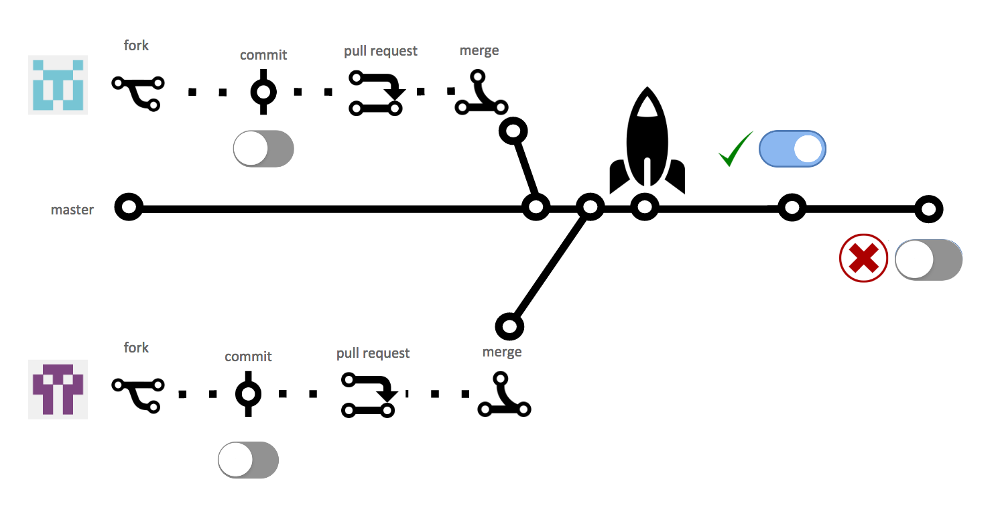
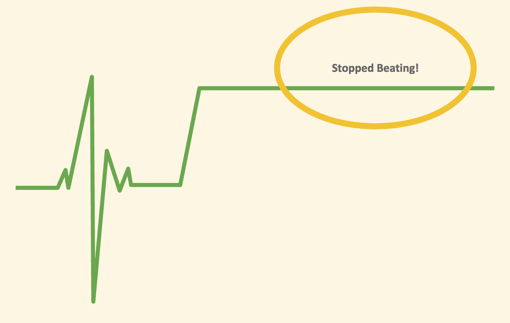

Feature Toggles
===============

[](https://travis-ci.org/PragmaTeam/feature-toggles)

Example of using feature techniques at Application level, so here we'll focus
more on the category of [Release
toggles](https://martinfowler.com/articles/feature-toggles.html#ReleaseToggles).

## The process of toggling:

In order to make every commit production ready, feature toggle is one of the
techniques that allow in-progress features to be checked in while still allows
that codebase to be deployed to production at any time. It also means that we're
separating **release** from **deploy**.


_feature toggle during the release process_

Step-by-step:

* Toggle **OFF**, start to commit/push your changes
* Release it, test it (e.g.: different environments, limit range of users)
* Then you can toggle **ON**
* If you notice a critical bug or some unexpected behaviour, instead of
  rollback or revert all the things, consider rollforward, turn the feature off
  and take your time to fix it.
* Once you are happy with your feature in place, remember to **recycle** the toggle.

The usage of feature toggle requires a lot of discipline and must be used
carefully. You might end up with toggles of toggles or you could be in a
situation where you just don’t know where else that toggle has being used, so
you’ll never deleted it. Be mindful that you can work without it, using
different techniques like [Branch by
Abstraction](https://medium.com/r/?url=https%3A%2F%2Fmartinfowler.com%2Fbliki%2FBranchByAbstraction.html)
that enables you gradually make changes in a total decoupled code which also have
the benefit of separation of concerns, making easy to maintain.

### The example of heart monitor

This repository use as an example the heart monitor, which is a quite simple way
to describe a few new requirements in order to simulate how would we apply
feature toggling at the application level. It's organized by branches, so
the [master branch](https://github.com/PragmaTeam/feature-toggles) will contain
the final state and you can travel in time through the branches
[feature#1](https://github.com/PragmaTeam/feature-toggles/tree/feature%231),
[feature#2](https://github.com/PragmaTeam/feature-toggles/tree/feature%232) and so on.
You can also keep track of the feature toggling journey through the
[commits](https://github.com/PragmaTeam/feature-toggles/commits/master).

You can learn with more details how [cardiac monitoring
works](https://en.wikipedia.org/wiki/Cardiac_monitoring) but on this example
we'll over simplify what it is. Imagine that our software collects signals over
time, and every minute the machine sends a signal value that our software will
evaluate it and plot a chart, like on the image below:


_heart monitor example_

### [Feature #1 - Heart beating status](https://github.com/PragmaTeam/feature-toggles/tree/feature%231)

- Given a collection of cardiac pulses as signals are available
- When the monitor evaluates certain amount of time series data
- Then it should send a message weather the heart has stopped or it's still beating

Example:

1. If the line is flat (all signals remains 0), the status will indicate that the heart has stopped.
2. If all signals varies with higher/lower values the status will indicate that the heart is still beating.

This code is also available on the branch [feature#1](https://github.com/PragmaTeam/feature-toggles/tree/feature%231).

### [Feature #2 - Heart beating status](https://github.com/PragmaTeam/feature-toggles/tree/feature%232)

- Given a collection of cardiac pulses as signals are available
- When the monitor evaluates certain amount of time series data
- And all signals remains the same
- Then the heart beating status should be **stopped**

Example:

1. If the line is flat (all signals remains the same), the status will indicate that the heart has stopped.
2. If all signals varies with higher/lower values the status will indicate that the heart is still beating.


_heart monitor example_

This code is also available on the branch [feature#2](https://github.com/PragmaTeam/feature-toggles/tree/feature%232)
and the pull request can also be followed through [here](https://github.com/PragmaTeam/feature-toggles/pull/1).

### Reclycling feature #2 once it's done

The feature toggle was removed on branch [recycling-feature#2](https://github.com/PragmaTeam/feature-toggles/tree/recycling-feature%232)
and the pull request can also be followed through [here](https://github.com/PragmaTeam/feature-toggles/pull/2)

The following features will be described here in the future.

### Next steps:

* Describe new features
* Add new code that satisfies the new requirements using feature toggles
  * Use different branches to illustrate how it would look like in a real scenario.

## Setup:

Install [node.js](https://nodejs.org/en/download/current/). At this moment,
we're using `v7.6.0`.

Install the dependencies:

```
$ npm install
```

## Running the tests:

```
$ npm test
```

## References:

* [Continuous Delivery Book](https://www.amazon.com/dp/0321601912?tag=contindelive-20)
* [Release it Book](https://pragprog.com/book/mnee/release-it)
* [Feature Toggles by Martin Fowler](https://martinfowler.com/articles/feature-toggles.html)
* [Branch by Abstraction by Martin Fowler](https://martinfowler.com/bliki/BranchByAbstraction.html)
